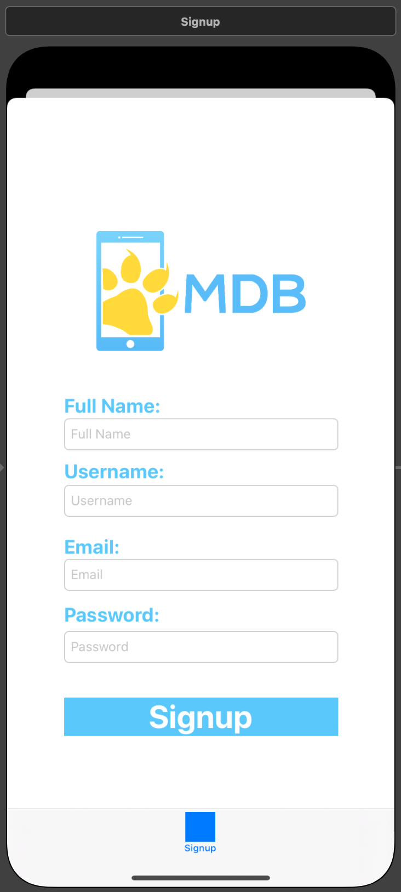

# mdbSocials

## Description
Hi! This is my third project that I've made for Mobile Developers of Berkeley, along with my partner Maggie Yi. This project is called mdbSocials, where users can look at all the social events created by MDB members, and notify if they're interested! It consists of 5 screens, where you can login, signup, look at events, create an event, and view an event page. We had lots of fun making this project, but in the future we would definitely try to condense some of the code I wrote for the advanced filtering. Furthermore, I managed to follow the model of MVC this time, so I definitely would like to see improvement in the future!

## Screen 1

This is the starter screen, which is the Login Screen.

## Screen 2

This is the second screen, which is the Signup Screen.

## Screen 3

This is the third screen, which is the Create Event detail.

## Screen 4

This is the fourth screen, which is the Events detail.

## Screen 5

This is the starter screen, which is the Events description detail, where you can also choose to notify that you're interested!
